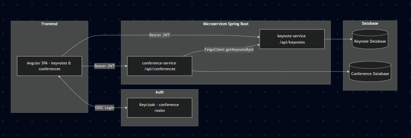

# 🧩 Microservices Conference Management

## 1. Description du projet

Ce projet est une application basée sur une architecture **microservices** permettant de gérer :

-  **Keynotes** (intervenants)
-  **Conferences** (sessions, keynote associé, reviews, score…)
-  **Reviews** (avis sur les conférences)
-  **Front Angular** pour l’interface utilisateur
-  **Keycloak** pour l’authentification & l’autorisation (OAuth2 / OpenID Connect)

Technos principales :

- **Backend** : Java 17, Spring Boot 3, Spring Data JPA, Spring Security, OpenFeign
- **Front** : Angular, Bootstrap
- **Auth** : Keycloak (JWT)
- **DB** : H2 / MySQL

---

## 2. Architecture globale

Les services principaux sont :

- `keynote-service` : gestion des intervenants (Keynotes)
- `conference-service` : gestion des conférences et des reviews
- `angular-front` : application SPA pour consommer les APIs
- `keycloak` : serveur d’authentification



---

## 3. Microservices

### 🎤 keynote-service

Gère les intervenants :

- `Keynote` : `id`, `lastName`, `firstName`, `email`, `functionTitle`
- DTOs : `KeynoteRequestDTO`, `KeynoteResponseDTO`
- `KeynoteRepository` : `JpaRepository<Keynote, Long>`
- API REST (`/api/keynotes`) avec un `KeynoteRestController` et un `KeynoteService` (CRUD complet)

Endpoints principaux :

- `GET /api/keynotes` — liste des keynotes
- `GET /api/keynotes/{id}` — détail d’un keynote
- `POST /api/keynotes` — ajouter
- `PUT /api/keynotes/{id}` — mettre à jour
- `DELETE /api/keynotes/{id}` — supprimer

Un `CommandLineRunner` peut être utilisé au démarrage pour insérer quelques keynotes de test.

---

### conference-service

Gère les conférences et les avis.

**Entités principales** :

- `Conference` :
    - `id`, `title`, `type` (`ACADEMIQUE` / `COMMERCIALE`),
    - `keynoteId`, `date`, `duration`, `numberOfRegistrations`, `score`
    - relation `OneToMany` avec `Review`
- `Review` :
    - `id`, `date`, `text`, `stars`, `conference`

**DTOs** :

- `ConferenceRequestDTO`, `ConferenceResponseDTO`
- `ReviewRequestDTO`, `ReviewResponseDTO`
- `KeynoteResponseDTO` (copie locale pour les infos keynote récupérées via Feign)

**Communication inter-service** (OpenFeign) :

```java
@FeignClient(name = "keynote-service")
public interface KeynoteRestClient {

    @GetMapping("/api/keynotes/{id}")
    KeynoteResponseDTO getKeynoteById(@PathVariable Long id);

    @GetMapping("/api/keynotes")
    List<KeynoteResponseDTO> getAllKeynotes();
}
